# TEXT2NER: Diagram procesu przetwarzania

```mermaid
flowchart TD
    A[Użytkownik wkleja tekst w aplikacji www] --> B[POST /process w Flask]
    B --> C[Utworzenie pliku logu diagnostycznego]
    C --> D[Przycięcie wejścia do 5000 znaków]
    D --> E[Ekstrakcja lat z całego dokumentu]
    E --> F[Gemini: tag_entities_with_gemini]
    F --> G[TEI-like XML z persName i placeName]
    G --> H[BeautifulSoup parsuje XML]
    H --> I[Pętla po wszystkich tagach encji]

    I --> J[Pobranie surface form i kontekstu encji]
    J --> K{Czy encja była już\nwcześniej skutecznie\nzidentyfikowana w tym dokumencie?}

    K -->|Tak| L[Użycie lokalnego cache wyniku]
    K -->|Nie| M[link_entity]

    M --> N[Gemini: analyze_form_with_gemini]
    N --> N1[normalized_best]
    N --> N2[lemma_candidates i surface_variants]
    N --> N3[office_terms i place_terms]
    N --> N4[context_clues i context_years]

    N --> O[build_query_plan]
    O --> O1[forma z tekstu]
    O --> O2[forma znormalizowana]
    O --> O3[polskie odpowiedniki]
    O --> O4[kombinacje imię plus urząd plus miejsce]

    O --> P[collect_candidates]
    P --> Q[Special:Search ~2 w WikiHum]
    P --> R[Special:Search ~2 w va.wiki.kul.pl]
    Q --> S[Filtrowanie po instance of]
    R --> S
    S --> T[Dedup i uporządkowanie kandydatów lokalnych]

    T --> U{Czy są kandydaci lokalni?}
    U -->|Tak| V[Gemini: build_link_decision]
    U -->|Nie| W[Fallback standardowy do Wikidata]

    W --> X[Special:Search ~2 w Wikidata]
    X --> Y[Filtrowanie po instance of]
    Y --> Z[Dedup i uporządkowanie kandydatów Wikidata]
    Z --> AA[Gemini: build_link_decision]

    V --> AB{Czy wybrano kandydata lokalnego?}
    AB -->|Tak| AC[decision = selected]
    AB -->|Nie| AD[Druga próba: tylko zwykła Wikidata]
    AD --> AE[Special:Search ~2 w Wikidata]
    AE --> AF[Filtrowanie po instance of]
    AF --> AG[Dedup i uporządkowanie kandydatów]
    AG --> AH[Gemini: build_link_decision]

    AA --> AI{Czy wybrano kandydata z Wikidata?}
    AH --> AI
    AI -->|Tak| AJ[decision = selected]
    AI -->|Nie| AK{Czy to persName\nz urzędem lub miejscem?}

    AK -->|Nie| AL[decision = none]
    AK -->|Tak| AM[Fallback plwiki dla osób]
    AM --> AN[Budowa polskich zapytań encyklopedycznych]
    AN --> AO[Przykłady: Mikołaj biskup chełmiński]
    AO --> AP[plwiki search API]
    AP --> AQ[Pobranie pageprops i extract]
    AQ --> AR[Odczyt wikibase_item dla stron]
    AR --> AS[Konwersja na kandydatów Wikidata]
    AS --> AT[Dołączenie tytułu i leadu z plwiki]
    AT --> AU[Gemini: build_link_decision]

    AU --> AV{Czy wybrano kandydata z plwiki fallback?}
    AV -->|Tak| AW[decision = selected]
    AV -->|Nie| AL

    AC --> AX[Ustawienie key i ref]
    AJ --> AX
    AW --> AX
    AL --> AY[Ustawienie tylko key]
    L --> AZ[Użycie key/ref z cache]

    AX --> BA{Dodaj do listy\nzidentyfikowanych encji}
    AY --> BB{Dodaj do listy\nniezidentyfikowanych tagów}
    AZ --> BA

    BA --> BC{Czy są kolejne encje?}
    BB --> BC
    BC -->|Tak| I
    BC -->|Nie| BD[Złożenie końcowego TEI XML]
    BD --> BE[Sortowanie entities]
    BE --> BF[Sortowanie unresolved_entities]
    BF --> BG[JSON response]

    BG --> BH[xml]
    BG --> BI[entities]
    BG --> BJ[unresolved_entities]
    BG --> BK[diagnostic_log_file]
```

## Skrót kroków

1. Użytkownik wysyła tekst do endpointu `/process`.
2. Aplikacja tworzy nowy plik logu w katalogu `log/`.
3. Z całego dokumentu wyciągane są lata, które później pomagają w ocenie chronologicznej kandydatów.
4. Gemini rozpoznaje encje i otacza je tagami `persName` oraz `placeName`.
5. Flask parsuje XML i przechodzi po każdej encji osobno.
6. Jeśli identyczna encja była już wcześniej skutecznie zidentyfikowana w tym samym dokumencie, wynik jest pobierany z cache.
7. W przeciwnym razie aplikacja:
   - prosi Gemini o ostrożną analizę formy,
   - buduje plan zapytań do baz referencyjnych,
   - szuka kandydatów najpierw w `WikiHum` i `va.wiki.kul.pl`,
   - filtruje kandydatów po typie encji na podstawie `instance of`,
   - jeśli lokalnych kandydatów nie ma, przechodzi od razu do zwykłej `Wikidata`,
   - jeśli lokalni kandydaci są, ale nie zostaną wybrani, wykonuje drugą próbę tylko na zwykłych kandydatach z `Wikidata`,
   - jeśli nadal brak rozstrzygnięcia i encja jest `persName`, uruchamia fallback przez polską Wikipedię.
8. Fallback `plwiki` buduje polskie zapytania encyklopedyczne, pobiera wyniki wyszukiwania, odczytuje `wikibase_item`, pobiera lead artykułu i zamienia te trafienia na kandydatów `Wikidata`.
9. Gemini dostaje kandydatów wraz z opisami, aliasami, faktami z właściwości, oceną chronologiczną i ewentualnym leadem z polskiej Wikipedii.
10. Jeśli wybór się powiedzie, encja dostaje `ref`; jeśli nie, zostaje przynajmniej `key`.
11. Po przetworzeniu wszystkich encji aplikacja zwraca:
   - gotowy XML/TEI,
   - listę zidentyfikowanych encji,
   - listę niezidentyfikowanych tagów,
   - ścieżkę do pliku logu diagnostycznego.

## Uwagi

- Wyszukiwanie działa obecnie tylko przez `Special:Search` w instancjach Wikibase.
- Fallback semantyczny przez SPARQL do Wikidaty pozostaje w kodzie, ale jest aktualnie wyłączony.
- Dla `persName` aplikacja może wzbogacić kandydatów `Wikidata` o lead z polskiej Wikipedii nawet poza fallbackiem `plwiki`, jeśli opis z samej Wikidaty jest zbyt ubogi.

## Najważniejsze funkcje w kodzie

- [app.py](/home/piotr/ihpan/text2ner/app.py:95) - główny endpoint `/process`
- [names_linking.py](/home/piotr/ihpan/text2ner/names_linking.py:2423) - centralny pipeline `link_entity(...)`
- [names_linking.py](/home/piotr/ihpan/text2ner/names_linking.py:2153) - analiza formy przez Gemini
- [names_linking.py](/home/piotr/ihpan/text2ner/names_linking.py:2098) - zbieranie kandydatów z lokalnych instancji i Wikidaty
- [names_linking.py](/home/piotr/ihpan/text2ner/names_linking.py:1763) - fallback `plwiki` dla `persName`
- [names_linking.py](/home/piotr/ihpan/text2ner/names_linking.py:2372) - końcowy wybór kandydata przez Gemini
- [names_linking.py](/home/piotr/ihpan/text2ner/names_linking.py:2511) - rozpoznawanie encji w surowym tekście
